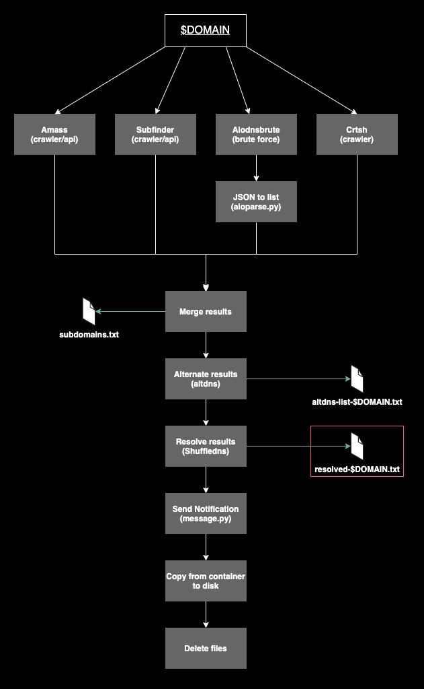

[](https://twitter.com/avasdream_)


## Subdomain enumeration container

This repository holds all files to build my subdomain enumeration container. The core components are the Dockerfile to set up all the tools/wordlists and the bash script (`main.sh`) to execute the tools and clean the data. 
To get the most accurate attack surface of a domain/organisation the container utilises multiple tools. 

1. [Amass](https://github.com/OWASP/Amass)
2. [Subfinder](https://github.com/projectdiscovery/subfinder)
3. [Aiodnsbrute](https://github.com/blark/aiodnsbrute)
4. Manually scraping crtsh
5. [Altdns](https://github.com/infosec-au/altdns)
6. [Massdns/Shuffledns](https://github.com/projectdiscovery/shuffledns)

These steps are done when executing the container: 




## Installation


```bash
git clone https://github.com/AvasDream/docker-subdomain-worker.git
cd docker-subdomain-worker
docker build . -t subs
```

## Usage

```bash
docker run -it --rm -v "$(pwd):/data" subs $domain $telegram_chat_id $telegram_secret
```

## Contributing
Pull requests are welcome. For major changes, please open an issue first to discuss what you would like to change.

Please make sure to update tests as appropriate.

## License
[MIT](https://choosealicense.com/licenses/mit/)